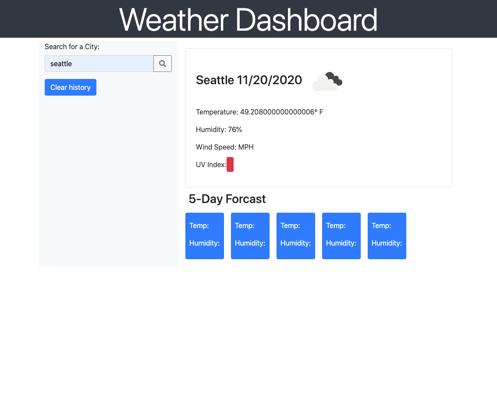

# Weather App
The Weather app homework was to help better our understanding of retrieving data from API's and how to do just that. We were to build a weather dashboard like the one ive created below. I have not finished this fully but it was a great introduction to API's

## Screenshot:

## Links:
### To Repo:
https://merikettapearl212.github.io/weather_app/

### To Github:
https://github.com/merikettapearl212/weather_app

